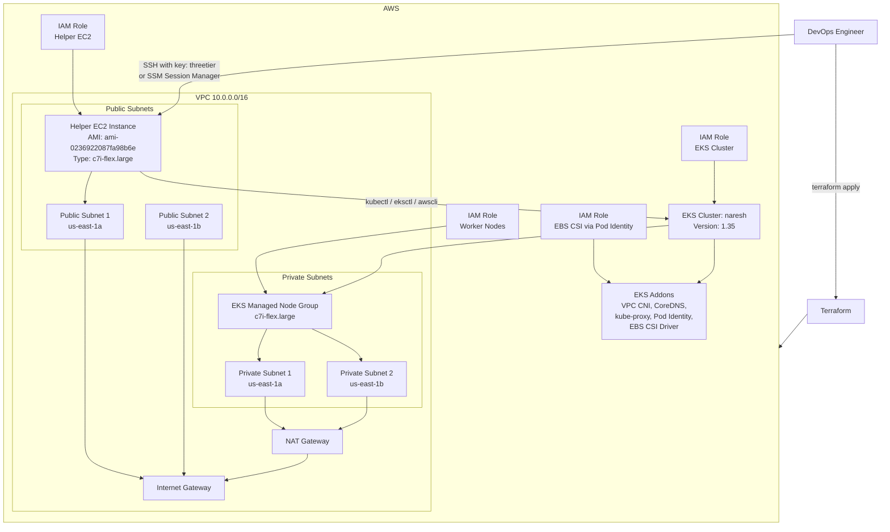

# Day 8 - Terraform EKS

## What This `main.tf` Is

This Terraform file builds a complete **Amazon EKS environment** on AWS.

It creates:
- A custom VPC
- 2 public subnets and 2 private subnets across 2 Availability Zones
- Internet Gateway and NAT Gateway for network access
- IAM roles for the EKS control plane, worker nodes, and helper EC2 instance
- An EKS cluster
- An EKS managed node group
- A helper EC2 instance with `kubectl`, `eksctl`, and `awscli`
- EKS addons like VPC CNI, CoreDNS, kube-proxy, Pod Identity Agent, and EBS CSI Driver

## Why This File Exists

The purpose of this file is to **automate Kubernetes infrastructure setup**.

Instead of creating AWS resources manually in the console, Terraform creates everything in a repeatable way. That makes the environment:
- Faster to create
- Easier to manage
- Easier to change later
- Consistent every time

## What Each Main Section Does

### 1. Provider and Variables
- Selects AWS as the provider
- Uses `us-east-1`
- Defines the EKS Kubernetes version
- Defines the EC2 key pair name as `threetier`

### 2. VPC and Networking
- Creates one VPC: `10.0.0.0/16`
- Creates public subnets for internet-facing resources
- Creates private subnets for EKS worker nodes
- Adds an Internet Gateway for public internet access
- Adds a NAT Gateway so private subnets can reach the internet for updates/downloads

### 3. Security Group
- Creates one security group that currently allows all inbound and outbound traffic
- Good for practice, but too open for production use

### 4. IAM Roles
- One IAM role for the EKS control plane
- One IAM role for worker nodes
- One IAM role for the helper EC2 instance
- One IAM role for the EBS CSI driver through EKS Pod Identity

### 5. EKS Cluster
- Creates the cluster named `naresh`
- Uses private subnets for the cluster networking
- Keeps the cluster API endpoint publicly reachable

### 6. Node Group
- Creates managed worker nodes for the cluster
- Uses `c7i-flex.large`
- Spreads nodes across 2 private subnets
- Keeps scaling between `4` and `8` nodes with desired size `6`

### 7. Helper EC2 Instance
- Launches a separate EC2 instance in a public subnet
- Uses your AMI: `ami-0236922087fa98b6e`
- Uses instance type `c7i-flex.large`
- Uses SSH key pair `threetier`
- Installs `kubectl`, `eksctl`, and `awscli`
- Can be used to manage the EKS cluster

### 8. EKS Addons
- `vpc-cni` for pod networking
- `coredns` for cluster DNS
- `kube-proxy` for service networking
- `eks-pod-identity-agent` for pod IAM identity
- `aws-ebs-csi-driver` for EBS-based persistent volumes

## What This Will Achieve In The End

After `terraform apply`, you will have:
- A working AWS network for Kubernetes
- A ready EKS cluster
- Managed worker nodes running in private subnets
- A helper EC2 machine you can use to connect and manage the cluster
- Core Kubernetes addons already installed
- Storage support through the EBS CSI driver

In short, this gives you a **full base platform for running Kubernetes workloads on AWS**.

## High-Level Architecture Diagram

## End-to-End Flow

1. Terraform creates the VPC, subnets, gateway, routes, and security group.
2. Terraform creates IAM roles and policy attachments.
3. Terraform creates the EKS control plane.
4. Terraform creates the worker node group in private subnets.
5. Terraform creates the helper EC2 instance in the public subnet.
6. Terraform installs the EKS addons.
7. You connect to the helper EC2 instance and manage the cluster using `kubectl`, `eksctl`, or `aws`.

## Simple Summary

This project is a **Terraform-based AWS EKS setup** for practice.

At a high level:
- Terraform builds the AWS infrastructure
- EKS provides the Kubernetes control plane
- EC2 worker nodes run your containers
- A helper EC2 machine is used to access and manage the cluster
- Addons make networking, DNS, and storage work properly
